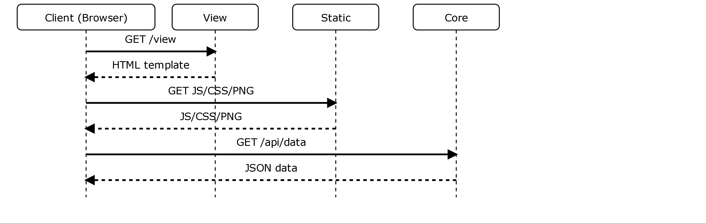
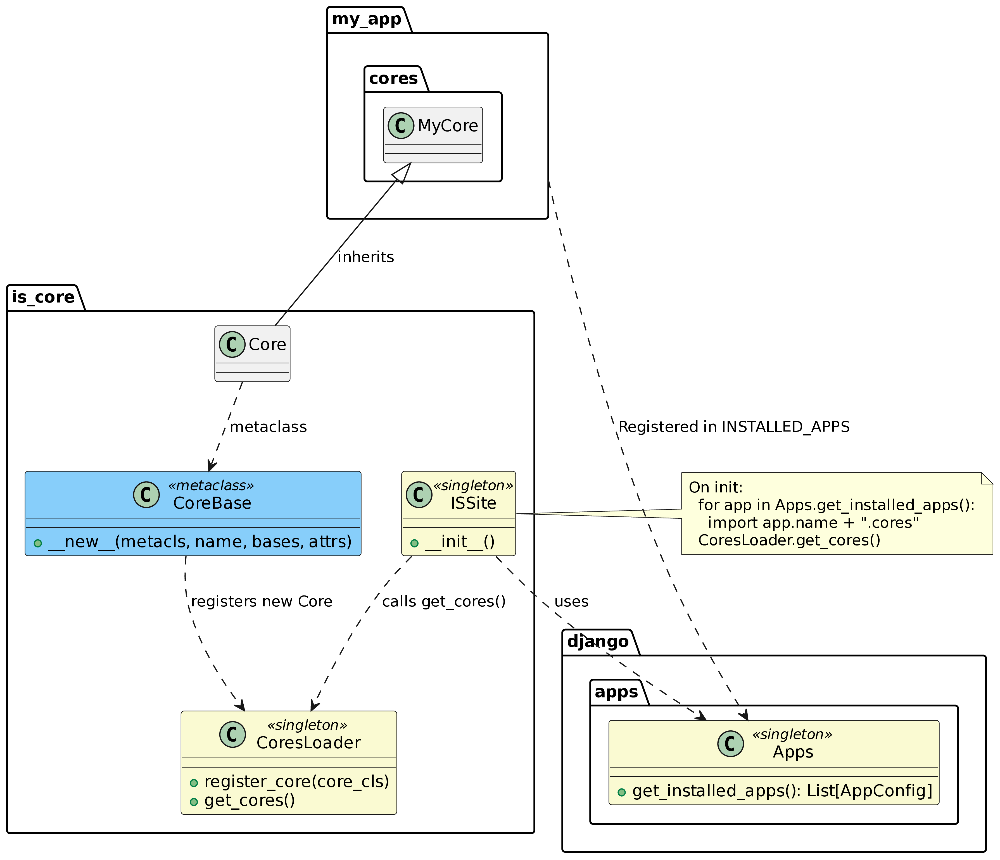

.. _architecture:

Architecture
============

Django IS Core is built on a modular architecture that separates UI rendering, REST API resources, and business logic. This section provides an overview of the core concepts and how they work together.

Core Concepts
-------------

The framework is built around several key concepts:

**Core**
  The main organizational unit that groups related views and REST resources together. A Core acts as a "roof" or container for functionality, automatically generating REST endpoints and managing URL patterns.

**Views**
  Server-rendered templates (HTML) or components that bootstrap JavaScript which then fetches data from REST endpoints. Views handle the UI presentation layer.

**Forms**
  Handle validation, sanitization of input, and rendering of fields through widgets. Forms are also used for read-only display states.

**Resources (REST)**
  Classes that define REST endpoints (GET/POST/PUT/DELETE) acting as the backend for UI actions. Resources provide the data and actions that views consume.

Request Flow
------------

A typical request in Django IS Core follows this pattern:

The flow in detail:

1. **Initial Request**: Browser hits a URL → View returns HTML template with links to JS/static files
2. **Static Assets**: Browser loads JavaScript, CSS, and images from static files
3. **Data Loading**: JavaScript calls the appropriate Core's REST endpoint for data (e.g., to populate a table)
4. **Interactive Updates**: Further interactions (filtering, row actions) go through REST → JS updates the DOM

Types of Core
-------------

Django IS Core provides several types of Core classes that can be combined based on your needs:

Which Core Type Should I Use?
^^^^^^^^^^^^^^^^^^^^^^^^^^^^^^

+---------------------------+---------------------------+---------------------------+
| **Use Case**              | **Core Type**             | **What You Get**          |
+===========================+===========================+===========================+
| Full admin interface      | DjangoUiRestCore          | UI views + REST API       |
+---------------------------+---------------------------+---------------------------+
| REST API only             | DjangoRestCore            | API endpoints only        |
+---------------------------+---------------------------+---------------------------+
| UI with external API      | DjangoUiCore              | UI views (REST elsewhere) |
+---------------------------+---------------------------+---------------------------+
| Custom frontend (React)   | DjangoRestCore            | API for your frontend     |
+---------------------------+---------------------------+---------------------------+
| Static pages only         | UiCore                    | Simple server-side views  |
+---------------------------+---------------------------+---------------------------+

UI Core
^^^^^^^

Handles server-side rendered views without REST queries during interaction. Useful for simple, static pages.

REST Core
^^^^^^^^^

Generates REST API over models providing CRUD operations, pagination, filtering, etc. Can be used independently to build custom frontends (e.g., React, Vue).

Django UI Core
^^^^^^^^^^^^^^

A UI Core specialized for Django models providing default list/detail/create views automatically.

Django REST Core
^^^^^^^^^^^^^^^^

Default REST API over Django models with automatic CRUD endpoints.

Combined Core (DjangoUiRestCore)
^^^^^^^^^^^^^^^^^^^^^^^^^^^^^^^^^

The most common case - combines UI + REST in a single Core. Provides both the admin interface and the REST API that powers it.

.. tip::
   **Recommended**: Use ``DjangoUiRestCore`` for most use cases. It gives you both admin UI and REST API with a single class definition.

Example::

    from is_core.main import DjangoUiRestCore

    class ArticleCore(DjangoUiRestCore):
        model = Article
        list_display = ('title', 'author', 'created_at')
        form_fields = ('title', 'content', 'author')

Registration and Auto-discovery
--------------------------------

Django IS Core uses automatic registration through metaclasses and singletons:

Architecture Overview
^^^^^^^^^^^^^^^^^^^^^

Registration Process
^^^^^^^^^^^^^^^^^^^^

1. **Django Apps Discovery**: ``INSTALLED_APPS`` → IS Core singleton (``ISSite``) discovers all apps
2. **Automatic Import**: In each app, the ``cores`` module is automatically imported (if it exists)
3. **Metaclass Registration**: Core classes use the ``CoreBase`` metaclass which automatically registers them into the ``CoresLoader`` singleton when the class is defined
4. **URL Generation**: In ``urls.py``, importing the IS Core singleton generates complete URLs including admin routes

Example of automatic registration::

    # myapp/cores.py
    from is_core.main import UIRestCore
    from .models import Article

    class ArticleCore(UIRestCore):
        model = Article
        # This Core is automatically registered when the module is imported
        # The CoreBase metaclass calls CoresLoader.register_core(ArticleCore)

Resources and Actions
---------------------

Generic Resource
^^^^^^^^^^^^^^^^

A custom endpoint where you implement get/post/put/delete methods and register it via ``get_rest_patterns`` on a specific path.

Example::

    from is_core.rest.resource import BaseResource

    class CustomResource(BaseResource):
        def get(self, request):
            return {'status': 'ok', 'data': [...]}

        @classmethod
        def get_rest_patterns(cls):
            return patterns(
                url(r'^custom-endpoint/$', cls.as_view(), name='custom'),
            )

DjangoCoreResource
^^^^^^^^^^^^^^^^^^

An internal "model resource" providing ready-made CRUD over a model. Behavior can be extended or overridden.

List Actions
^^^^^^^^^^^^

The backend returns a list of actions for each row via ``get_list_actions``:

**UI actions**
  e.g., redirect to detail view (without calling backend)

**API actions**
  e.g., delete action that calls REST; JavaScript executes the call and handles UI consequences (hide row, refresh, etc.)

Example::

    class ArticleCore(UIRestCore):
        model = Article

        def get_list_actions(self, obj, request):
            actions = []
            if request.user.has_perm('articles.change_article'):
                actions.append({
                    'name': 'edit',
                    'url': self.get_edit_url(obj),
                    'type': 'ui'
                })
            if request.user.has_perm('articles.delete_article'):
                actions.append({
                    'name': 'delete',
                    'url': self.get_api_url('delete', obj.pk),
                    'type': 'api'
                })
            return actions

Custom Home
-----------

You can configure a custom home view/core via Django settings::

    # settings.py
    IS_CORE_HOME_CORE = 'myapp.cores.CustomHomeCore'
    IS_CORE_HOME_VIEW = 'myapp.views.CustomHomeView'

The default home is a UI Core without REST. If your home needs REST functionality, you need to specify a combined core.

Integration in 4 Steps
----------------------

Adding Django IS Core to a new project is straightforward:

1. Install IS Core in your project::

    pip install skip-django-is-core

2. Add the app and register IS Core in ``INSTALLED_APPS``::

    INSTALLED_APPS = [
        ...
        'is_core',
        'block_snippets',
        'pyston',
        ...
    ]

3. Add required settings (see :ref:`installation` for details)

4. Add IS Core URL patterns::

    # urls.py
    from is_core.main import IS_CORE

    urlpatterns = [
        path('', IS_CORE.urls),
    ]

After these steps, login/authentication and basic administration are ready to use.

.. seealso::

   :ref:`installation`
      Complete installation guide with all configuration options

   :ref:`cores`
      Detailed Core class documentation and API reference

Monkey Patching
---------------

During IS Core initialization, several Django components are enhanced:

**Widgets (forms)**
  - Addition of ``className`` attribute
  - Placeholder support
  - Custom rendering for date/time, file/image inputs, multiple choice fields

**Read-only fields**
  - Global default ``readonly=False``
  - Fields can be switched to read-only at render time using special read-only widgets

**Models**
  - Improvements for displaying relationships (FK/M2M)
  - Enhanced display of URLField
  - Better object naming for admin display
